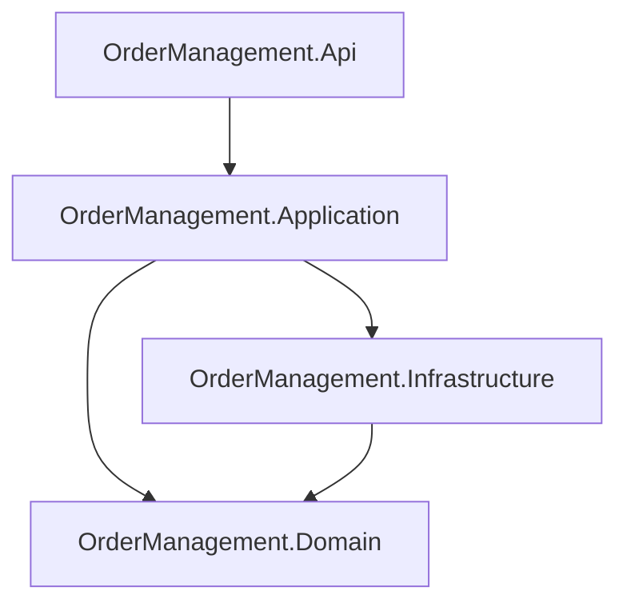

# Project Structure: OrderManagement-DDD-CQRS-Final

## Description
- **OrderManagement.Api**: Entry point for HTTP requests (controllers, endpoints).
- **OrderManagement.Application**: Application logic, CQRS handlers, commands, queries.
- **OrderManagement.Domain**: Core business entities, value objects, domain services, repositories (interfaces).
- **OrderManagement.Infrastructure**: Implementation of repositories, database access, external integrations.

### Relationships
- The API project depends on Application.
- Application depends on Domain and Infrastructure.
- Infrastructure depends on Domain for entity definitions.
