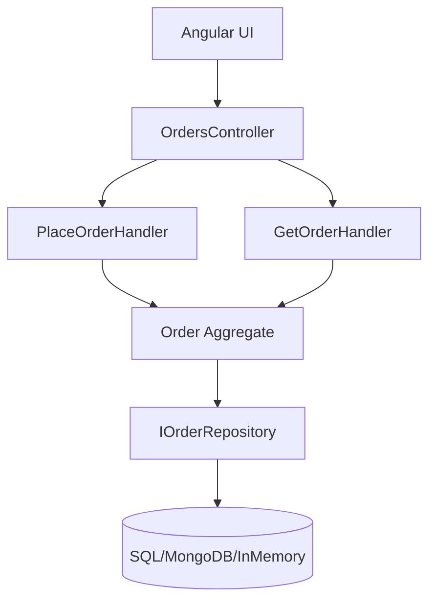

# OrderManagement Sample (DDD + CQRS)

This is a sample project demonstrating **Domain-Driven Design (DDD)** with **CQRS** using **.NET 8** for backend and **Angular 17** for frontend.

---

## 🚀 How to Run


## Backend API (.NET 8 + SQLite)

1. Ensure you have [.NET 8 SDK](https://dotnet.microsoft.com/download) installed.
2. From the project root, run:

```bash
cd src/Api
dotnet run
```

The API will start (by default at `https://localhost:5001` or `http://localhost:5000`).
It uses a local SQLite database file (`orders.db`).

## Frontend (Angular 17)

1. Ensure you have [Node.js](https://nodejs.org/) and [Yarn](https://yarnpkg.com/) installed.
2. From the project root, run:

```bash
cd frontend/angular-app
pnpm install
pnpm start
```

The app will be available at: [http://localhost:4200](http://localhost:4200)

---

---

## 📊 Architecture (Mermaid)


