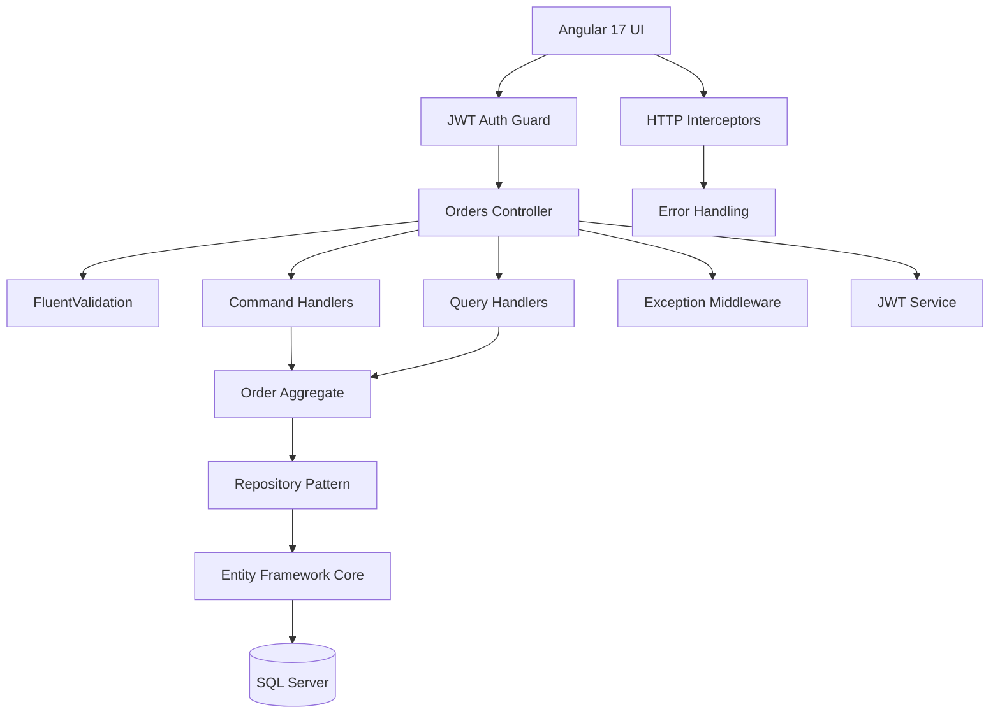

# 🏢 Order Management System - Enterprise Demo

> **Senior .NET Fullstack with Angular** - Interview Ready Application

A comprehensive enterprise-grade order management system showcasing modern **Domain-Driven Design (DDD)**, **CQRS**, **JWT Authentication**, and **Clean Architecture** patterns using **.NET 8** backend with **Angular 17** frontend.

---

## 🎯 **Overview**

This application demonstrates **senior-level full-stack development skills** with enterprise patterns and best practices:

- **Backend**: .NET 8, Clean Architecture, CQRS, JWT Authentication, FluentValidation, Global Exception Handling
- **Frontend**: Angular 17, TypeScript, Angular Material, Tailwind CSS, JWT Authentication, Reactive Programming
- **Architecture**: DDD, CQRS, Repository Pattern, Dependency Injection, HTTP Interceptors

---

## ✨ **Key Features**

### 🔐 **Security & Authentication**
- **JWT Bearer Authentication** with secure token management
- **Route Guards** protecting unauthorized access
- **HTTP Interceptors** for automatic token injection
- **Role-based authorization** ready for extension

### 🏗️ **Backend Architecture (.NET 8)**
- **Clean Architecture** with DDD principles
- **CQRS Pattern** with dedicated Command/Query handlers
- **FluentValidation** for comprehensive input validation
- **Global Exception Handling** with proper HTTP status codes
- **Entity Framework Core** with SQL Server integration
- **Swagger/OpenAPI** documentation
- **Dependency Injection** throughout the application

### 🎨 **Frontend Architecture (Angular 17)**
- **Modern Angular 17** with signals and standalone components
- **TypeScript** with strict type safety
- **Angular Material** for consistent UI components
- **Tailwind CSS** for responsive design
- **HTTP Interceptors** for authentication and error handling
- **Reactive Forms** with validation feedback

### 📊 **Business Features**
- **Order Management** with full CRUD operations
- **Order Status Tracking** with real-time updates
- **Pagination & Sorting** for large datasets
- **Input Validation** with user-friendly error messages
- **Loading States** and error handling throughout

---

## 🚀 **Quick Start**

### Prerequisites
- [.NET 8 SDK](https://dotnet.microsoft.com/download)
- [Node.js 18+](https://nodejs.org/)
- [SQL Server](https://www.microsoft.com/en-us/sql-server) (or SQL Server Express)

### 1. Backend API (.NET 8)

```bash
# Navigate to backend directory
cd backend/Api

# Restore dependencies
dotnet restore

# Run the application
dotnet run
```

**API Endpoints:**
- **Main API**: https://localhost:56642
- **Swagger Documentation**: https://localhost:56642/swagger
- **Health Check**: https://localhost:56642/health

### 2. Frontend (Angular 17)

```bash
# Navigate to frontend directory
cd frontend/angular-app

# Install dependencies
pnpm install

# Start development server
pnpm start
```

**Application URLs:**
- **Main App**: http://localhost:4200
- **Login**: http://localhost:4200/auth/login

---

## 🔑 **Demo Credentials**

```
Username: admin
Password: admin123
```

---

## � **API Documentation**

### Authentication Endpoints
```http
POST /api/auth/login
Content-Type: application/json

{
  "username": "admin",
  "password": "admin123"
}
```

### Order Management Endpoints
```http
# Get orders (Protected)
GET /api/orders?page=1&pageSize=10&sortBy=createdAt&desc=true
Authorization: Bearer {token}

# Create order (Protected)
POST /api/orders
Authorization: Bearer {token}
Content-Type: application/json

{
  "customerName": "John Doe",
  "lines": [
    {
      "product": "Laptop",
      "quantity": 1,
      "price": 999.99,
      "currency": "USD"
    }
  ]
}

# Get order by ID (Protected)
GET /api/orders/{id}
Authorization: Bearer {token}

# Update order status (Protected)
PUT /api/orders/{id}/status
Authorization: Bearer {token}
Content-Type: application/json

{
  "status": "Completed"
}
```

---

## 🏗️ **Architecture Overview**



---

## 📂 **Project Structure**

```
├── backend/
│   ├── Api/                 # Web API Layer
│   │   ├── Controllers/     # REST Controllers
│   │   ├── Middleware/      # Global Exception Handling
│   │   ├── Services/        # JWT Token Service
│   │   └── Program.cs       # Application Setup
│   ├── Application/         # Application Layer (CQRS)
│   │   ├── Commands/        # Command Handlers
│   │   ├── Queries/         # Query Handlers
│   │   └── Validators/      # FluentValidation Rules
│   ├── Domain/              # Domain Layer (DDD)
│   │   ├── Entities/        # Domain Entities
│   │   ├── ValueObjects/    # Value Objects
│   │   └── Repositories/    # Repository Interfaces
│   └── Infrastructure/      # Infrastructure Layer
│       └── Persistence/     # Entity Framework Implementation
├── frontend/
│   └── angular-app/
│       ├── src/app/
│       │   ├── core/        # Authentication & Guards
│       │   ├── features/    # Feature Modules
│       │   │   ├── auth/    # Login Components
│       │   │   └── orders/  # Order Management
│       │   └── shared/      # Shared Components
└── tests/                   # Unit & Integration Tests
```

---

## 🧪 **Testing**

### Backend Tests
```bash
cd backend/tests/OrderManagement.Api.Tests
dotnet test
```

### Frontend Tests
```bash
cd frontend/angular-app
npm test
```

---

## 🔧 **Technology Stack**

### Backend (.NET 8)
- **Framework**: ASP.NET Core 8.0
- **Authentication**: JWT Bearer Tokens
- **Validation**: FluentValidation
- **ORM**: Entity Framework Core 8.0
- **Database**: SQL Server
- **Documentation**: Swagger/OpenAPI
- **Architecture**: Clean Architecture + DDD + CQRS

### Frontend (Angular 17)
- **Framework**: Angular 17 with standalone components
- **Language**: TypeScript 5.0
- **UI Components**: Angular Material 17
- **Styling**: Tailwind CSS 3.0
- **State Management**: Angular Signals
- **HTTP Client**: Angular HTTP with interceptors
- **Build Tool**: Angular CLI with Webpack

### Development Tools
- **Package Manager**: pnpm (Frontend), NuGet (Backend)
- **Code Quality**: ESLint, Prettier (Frontend), EditorConfig
- **Testing**: Jasmine/Karma (Frontend), xUnit (Backend)

---

## 🎖️ **Enterprise Patterns Demonstrated**

### Backend Patterns
- ✅ **Clean Architecture** - Separation of concerns across layers
- ✅ **Domain-Driven Design** - Rich domain models and business logic
- ✅ **CQRS** - Command Query Responsibility Segregation
- ✅ **Repository Pattern** - Data access abstraction
- ✅ **Dependency Injection** - Loose coupling and testability
- ✅ **Global Exception Handling** - Centralized error management
- ✅ **Input Validation** - FluentValidation with custom rules
- ✅ **JWT Authentication** - Stateless security

### Frontend Patterns
- ✅ **Component Architecture** - Modular and reusable components
- ✅ **Service Layer** - Business logic separation
- ✅ **HTTP Interceptors** - Cross-cutting concerns
- ✅ **Route Guards** - Navigation security
- ✅ **Reactive Programming** - RxJS observables and signals
- ✅ **Error Handling** - User-friendly error messages
- ✅ **Type Safety** - Full TypeScript integration

---

## 📈 **Performance & Security**

- **JWT Token Management** with automatic refresh handling
- **HTTP Interceptors** for consistent error handling
- **Lazy Loading** for Angular feature modules
- **SQL Server** with Entity Framework optimization
- **CORS Configuration** for secure cross-origin requests
- **Input Sanitization** and validation at all layers

---

## 🚀 **Deployment Ready**

The application includes:
- **Docker support** (containers ready)
- **Environment configurations** for Development/Production
- **Health checks** for monitoring
- **Logging infrastructure** with Serilog
- **Error tracking** and monitoring ready