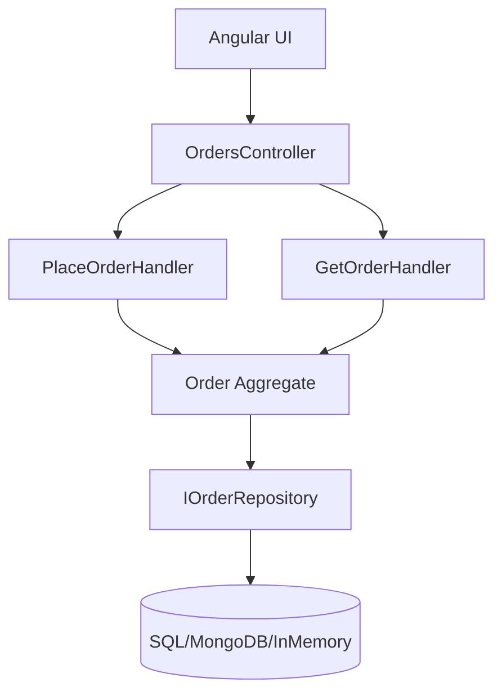

# OrderManagement Sample (DDD + CQRS)

This is a sample project demonstrating **Domain-Driven Design (DDD)** with **CQRS** using **.NET 8** for backend and **Angular 17** for frontend.

---

## 🚀 How to Run

### Backend (.NET 8)
```bash
cd src/Api
dotnet run
```

### Frontend (Angular 17)
```bash
cd frontend/angular-app
npm install
ng serve
```

Open browser at: `http://localhost:4200`

---

## 📊 Architecture (Mermaid)


